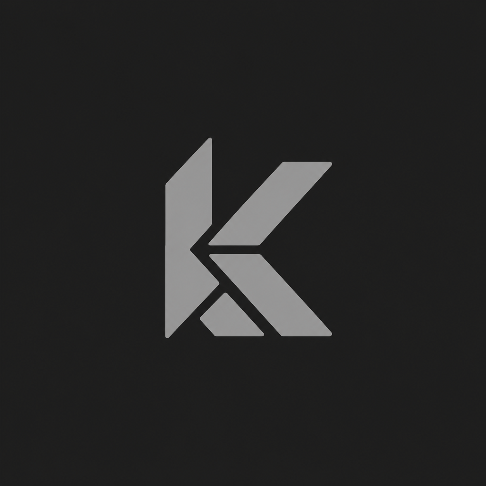

# Kyven Tools

<p align="center">
  <a href="https://github.com/vaaleerkiin/Kyven">
    
  </a>
</p>

**Local AI tools for node-based compositing. Open source, portable, and host-safe.**

Kyven Tools adds independent AI nodes to Foundry Nuke while keeping PyTorch, CUDA, model loading,
and long-running inference outside the Nuke process. Results are returned as ordinary cached image
sequences that remain usable without a live model connection.

> **Production-safe and commercially usable.** Inference stays local, source media is not uploaded,
> the project code is Apache-2.0, and every model currently enabled in the trusted catalog is marked
> for commercial use with pinned source and license metadata.
>
> **Project status:** active pre-alpha. Segment, Refine, and Inpaint are working in Nuke on Windows.
> Fusion and DaVinci Resolve adapters, Depth, and additional utilities are planned.

## Tools available today

| Node | Input | Purpose | Models |
| --- | --- | --- | --- |
| **Kyven Segment** | Source + Viewer prompts | Binary object masks and video propagation | SAM 2.1 Tiny / Small / Base+ / Large |
| **Kyven Refine** | Source + mask or trimap | Soft alpha refinement and trimap inspection | ViTMatte Small / Base |
| **Kyven Inpaint** | Source + removal mask | ROI-aware object removal and clean-up | LaMa ONNX Fast / Big-LaMa Native |

All new nodes default to a compositing-friendly **Source + Alpha** or **Source + Refined Alpha**
output where applicable.

## Why Kyven runs a local server

```text
Nuke Group node
      |
      | authenticated HTTP · 127.0.0.1 only
      v
Kyven Server -> job queue -> provider registry -> selected local model
      |
      v
Atomic per-node image cache -> ordinary Nuke Read
```

- Nuke never imports PyTorch or model implementations.
- Only the selected provider stays resident; switching tools releases the previous model.
- Jobs run asynchronously with progress, cancellation, and clear errors.
- Every node owns an isolated cache folder and can create a normal Nuke Read.
- The server accepts only loopback connections protected by a random local token.

## Quick start · Windows + Nuke

### 1. Install beside the repository

Clone or extract Kyven into its final folder, then double-click **`install.cmd`**.

PowerShell equivalent:

```powershell
powershell -ExecutionPolicy Bypass -File .\install.ps1
```

The console lets you choose one or more models. Pressing Enter installs the recommended 8 GB setup:
SAM 2.1 Small and ViTMatte Small. Everything stays inside the repository:

| Folder | Contents |
| --- | --- |
| `.venv/` | Private Python runtime and dependencies |
| `models/` | Selected checkpoints verified by size and SHA-256 |
| `.runtime/` | Server files, installer cache, logs, and Nuke caches |

No administrator access, EXE installer, registry changes, or system-wide Python packages are used.

### 2. Connect Nuke

Add the path printed by the installer to your existing `.nuke/init.py`:

```python
import nuke

nuke.pluginAddPath("D:/Kyven/hosts/nuke")
```

Replace `D:/Kyven` with your repository location, restart Nuke, then open:

```text
Nodes > Kyven > Segment
Nodes > Kyven > Refine
Nodes > Kyven > Inpaint
```

The installer deliberately does not edit `init.py` for the user.

Additional models can be installed later without leaving Nuke. Open **Kyven > Model Manager...**
or press **Model Manager...** inside any Kyven node, select a trusted catalog model, and choose
**Install Selected**. Nuke shows download progress and verifies the exact file size and SHA-256
before the model becomes selectable. The same panel can safely remove an unused model without
touching node caches or source media.

## Model guide

| Workload | Recommended choice | Hardware guidance | Main trade-off |
| --- | --- | --- | --- |
| Segment on 4 GB | SAM 2.1 Tiny | 4 GB VRAM | Lowest memory use |
| Segment on 8 GB | SAM 2.1 Small | 6 GB VRAM | Recommended balance |
| Higher-detail Segment | SAM 2.1 Base+ | 8 GB VRAM | May require fallback on an 8 GB GPU |
| Maximum Segment model | SAM 2.1 Large | 12 GB+ VRAM | Slowest and heaviest |
| Refine on 4–8 GB | ViTMatte Small | 4 GB+ or tiled | Fastest and recommended default |
| Maximum Refine quality | ViTMatte Base | 8 GB+ with tiling | 96.7 M parameters; slower and heavier |
| Fast Inpaint / Live | LaMa ONNX Fast | CPU, no GPU required | Fixed 512 × 512 model input |
| Detailed Inpaint | Big-LaMa Native | 4 GB+ or CPU | Native ROI detail, slower |

Install a specific model non-interactively:

```powershell
.\install.ps1 -Model sam2.1-small,vitmatte-small-composition-1k
.\install.ps1 -Model lama-2025jan-onnx,big-lama-native
```

See [Model selection and safety](docs/MODELS.md) for exact downloads, licenses, and VRAM guidance.

## Typical workflows

### Segment

1. Connect Source.
2. Place a positive Viewer point on the object; add negative points where required.
3. Optionally enable an animated Processing ROI.
4. Choose **Process Current Frame**, **Process Frame Range**, or SAM 2 video propagation.
5. Select Matte, Source + Alpha, Cutout, or Source output.

### Refine

1. Connect the original Source to input 0 and a coarse mask to input 1.
2. Leave **Generate Trimap from Mask** enabled for Segment, Roto, Keyer, or Paint masks.
3. Adjust the immediate CPU trimap preview, then process a frame or range with ViTMatte.
4. Inspect the refined alpha, exact trimap, Source + Alpha, or cutout outputs.

### Inpaint

1. Connect Source to input 0 and the removal mask to input 1.
2. Use Auto ROI for most shots; it crops around the mask plus Context Padding.
3. Use LaMa ONNX for fast iteration or Big-LaMa Native when the 512 input loses detail.
4. Keep Model Grow, Blend Grow, Feather, and Edge Color Match enabled to avoid visible patch edges.

## Cache controls

Every Kyven node uses the same compact Cache block:

| Control | Action |
| --- | --- |
| **Cache Folder** | Shows the exact folder owned by the node |
| **Create Matte Read** | Creates a normal Read for Segment or Refine output |
| **Create Result Read** | Creates a normal Read for an Inpaint frame or sequence |
| **Delete Node Cache** | Removes only the selected node's generated files |
| **Delete All Kyven Cache** | Removes all `.runtime/nuke_cache` data, never models or source media |

## Updating

Pull the latest repository, run `install.cmd` again, and restart Nuke. Verified models and downloads
are reused. Existing Groups can then be updated without changing their UUID or cache:

- `Kyven > Upgrade Selected Segment Node`
- `Kyven > Upgrade Selected Refine Node`
- `Kyven > Upgrade Selected Inpaint Node`

## Privacy, safety, and licensing

- Inference is local by default; the server binds only to `127.0.0.1`.
- Model downloads are pinned and verified before activation.
- Project code is licensed under Apache-2.0.
- Built-in provider code and model metadata are selected for commercial use.
- Model weights are downloaded during installation and are not committed to this repository.

Review [Third-party notices](THIRD_PARTY_NOTICES.md) before distribution in a production pipeline.

## Documentation

| Guide | What it covers |
| --- | --- |
| [Installation](docs/INSTALLATION.md) | Portable setup, updates, moving the repository |
| [Nuke workflow](docs/NUKE.md) | Node controls, outputs, ranges, cache, and server behavior |
| [Segment](docs/SEGMENT.md) | SAM prompts, ROI, tracking, CLI, and architecture |
| [Refine](docs/REFINE.md) | ViTMatte, trimap preview, tiling, and outputs |
| [Inpaint](docs/INPAINT.md) | LaMa models, ROI, edge-safe blending, outputs, and cache |
| [Models](docs/MODELS.md) | Catalog, hardware guidance, verification, and licenses |
| [Troubleshooting](docs/TROUBLESHOOTING.md) | Startup, CUDA, ROI, Read, cache, and log problems |
| [Server API](docs/SERVER.md) | Authenticated endpoints and request fields |
| [Benchmarks](docs/BENCHMARKS.md) | Development hardware observations |
| [Roadmap](docs/ROADMAP.md) | Depth, utilities, host adapters, and future work |

## Repository map

```text
Kyven
├── src/kyven/       server, providers, model catalog, CLI
├── hosts/nuke/      Nuke adapter and Group-node builders
├── docs/            user, technical, and roadmap documentation
├── tests/           host-neutral and adapter tests
├── models/          locally installed weights (not committed)
└── .runtime/        local logs and generated caches (not committed)
```

Kyven Tools is under active development. Cached renders should be treated as working assets, while
node layouts and provider APIs may still change between pre-alpha revisions.
